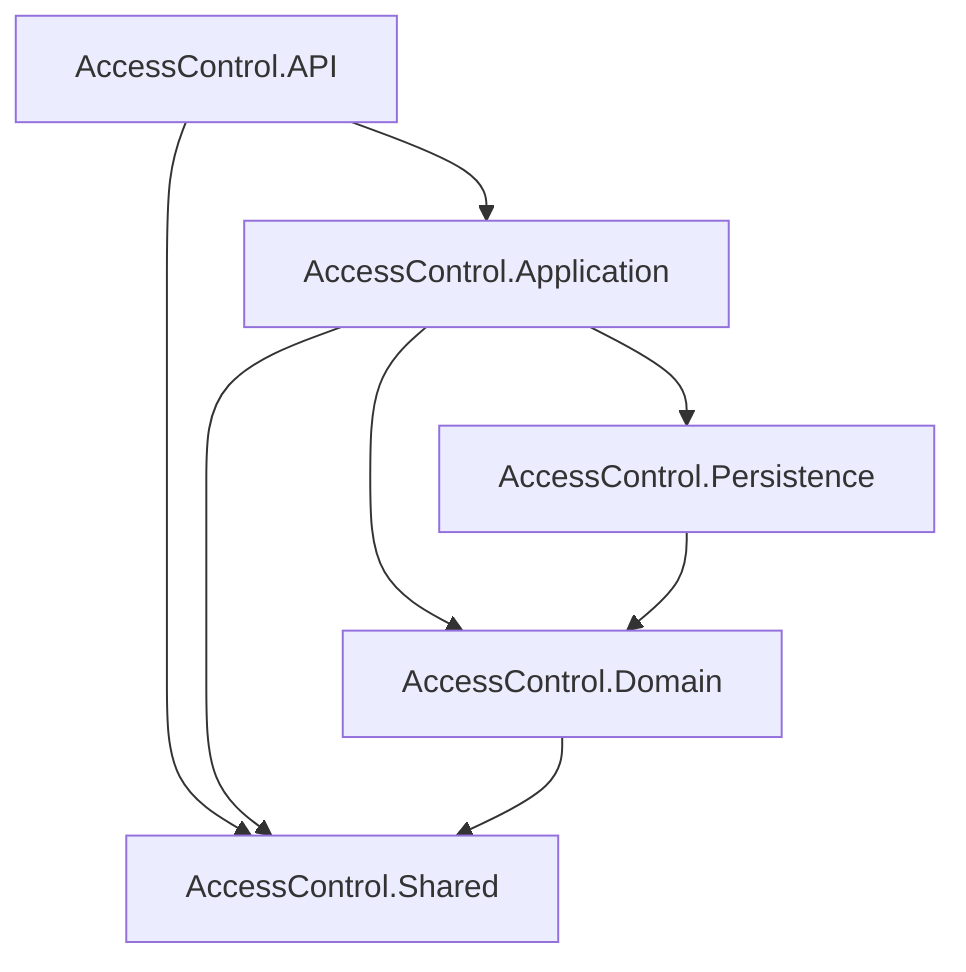

## 📁 Proyecto: `AccessControl`

```
AccessControl.sln
│
├── 📁 AccessControl.API             # Proyecto de presentación (Web API Controllers)
│   ├── Program.cs
│   ├── appsettings.json
│   └── Controllers
│       └── AuthController.cs
│       └── OwnersController.cs
│       └── VisitsController.cs
│       └── MenuController.cs
│       └── DashboardController.cs
│
├── 📁 AccessControl.Application     # Lógica de negocio e interfaces
│   ├── Interfaces
│   │   └── IAuthService.cs
│   │   └── IVisitService.cs
│   │   └── IMenuService.cs
│   │   └── IDashboardService.cs
│   └── Services
│       └── AuthService.cs
│       └── VisitService.cs
│       └── MenuService.cs
│       └── DashboardService.cs
│
├── 📁 AccessControl.Domain          # Entidades del dominio
│   └── Entities
│       └── User.cs
│       └── Residence.cs
│       └── Visit.cs
│       └── Menu.cs
│       └── RoleMenu.cs
│
├── 📁 AccessControl.Persistence     # Acceso a datos (EF Core, DbContext, repositorios)
│   ├── ApplicationDbContext.cs
│   ├── Generics
│   │   └── IRepository.cs
│   │   └── Repository.cs
│   └── Migrations
│       └── [EF Migration Files Here]
│
└── 📁 AccessControl.Shared          # DTOs, Enums, y código común
    ├── Dtos
    │   ├── Auth
    │   │   └── AuthDtos.cs
    │   └── Visit
    │       └── CreateVisitDto.cs
    │       └── UpdateVisitDto.cs
    │       └── VisitFilterDto.cs
    └── Enums
        └── Role.cs
```

---

###  diagrama de flujo de capas



### Reglas de codificación

*   **Nombres de proyectos:** `AccessControl.ProjectName`
*   **Nombres de archivos:** `ClassName.cs`
*   **Nombres de clases:** `PascalCase`
*   **Nombres de métodos:** `PascalCaseAsync` (para métodos asíncronos)
*   **Nombres de variables:** `camelCase`
*   **Interfaces:** `IPascalCase`
*   **DTOs:** `PascalCaseDto`
*   **Inyección de dependencias:** Usar el constructor para inyectar dependencias.
*   **Controladores:** Deben ser delgados y delegar la lógica de negocio a los servicios.
*   **Servicios:** Contienen la lógica de negocio y usan repositorios para acceder a los datos.
*   **Repositorios:** Abstraen el acceso a los datos y usan el `DbContext` de Entity Framework Core.
*   **Entidades:** Clases simples que representan las tablas de la base de datos.
*   **DTOs:** Clases simples para transferir datos entre capas.

### Buenas prácticas de validación y seguridad

*   **Validación:** Usar `FluentValidation` para validar los DTOs de entrada en la capa de la API.
*   **Autorización:** Usar políticas de autorización para restringir el acceso a los endpoints.
*   **Autenticación:** Usar JWT para autenticar a los usuarios.
*   **Secretos:** Usar el `Secret Manager` de .NET para almacenar secretos en desarrollo.
*   **CORS:** Configurar CORS para permitir solicitudes solo desde el frontend.

### Cómo agregar nuevos endpoints y repositorios

**Agregar un nuevo repositorio:**

1.  Crear una nueva interfaz en `AccessControl.Application/Interfaces` que herede de `IRepository<T>`.
2.  Crear una nueva clase en `AccessControl.Persistence/Repositories` que implemente la nueva interfaz y herede de `Repository<T>`.
3.  Registrar el nuevo repositorio en `Program.cs`.

**Agregar un nuevo endpoint:**

1.  Crear un nuevo DTO en `AccessControl.Shared/Dtos` si es necesario.
2.  Crear un nuevo método en la interfaz del servicio en `AccessControl.Application/Interfaces`.
3.  Implementar el nuevo método en la clase del servicio en `AccessControl.Application/Services`.
4.  Crear un nuevo método en el controlador en `AccessControl.API/Controllers` que use el nuevo método del servicio.

---
### 🔐 Security Note: Managing Secrets

**Do not store sensitive data like database passwords or JWT keys directly in configuration files.** This project is configured to use the .NET Secret Manager for development.

To configure your local environment, run the following commands from the `backend/AccessControl.API` directory:

```bash
dotnet user-secrets init
dotnet user-secrets set "ConnectionStrings:DefaultConnection" "Host=ep-mute-cherry-a4j6mcyc-pooler.us-east-1.aws.neon.tech;Database=verceldb;Username=default;Password=<YOUR_ACTUAL_PASSWORD>;Ssl Mode=Require;Trust Server Certificate=true"
dotnet user-secrets set "Jwt:Key" "<YOUR_SUPER_SECRET_JWT_KEY>"
```

Replace `<YOUR_ACTUAL_PASSWORD>` and `<YOUR_SUPER_SECRET_JWT_KEY>` with your actual credentials.

### 👤 User Creation

Users can be created via the API. The `POST /api/auth/register` endpoint is protected and requires an `Admin` user's JWT for authorization.

**Endpoint:** `POST https://localhost:7262/api/auth/register`

**Headers:**
- `Content-Type: application/json`
- `Authorization: Bearer <ADMIN_JWT_TOKEN>`

**Request Body:**

```json
{
  "email": "user@example.com",
  "firstName": "John",
  "lastName": "Doe",
  "apartmentNumber": "101",
  "password": "AStrongPassword123!",
  "role": <ROLE_ID>
}
```

**Role IDs:**
- `0`: Admin
- `1`: Guard
- `2`: Owner

**cURL Examples:**

*   **Create an Admin user:**
    ```bash
    curl -X POST https://localhost:7262/api/auth/register \
    -H "Content-Type: application/json" \
    -H "Authorization: Bearer <ADMIN_JWT_TOKEN>" \
    -d '{
      "email": "admin@example.com",
      "firstName": "Admin",
      "lastName": "User",
      "apartmentNumber": "000",
      "password": "AStrongPassword123!",
      "role": 0
    }'
    ```

*   **Create a Guard user:**
    ```bash
    curl -X POST https://localhost:7262/api/auth/register \
    -H "Content-Type: application/json" \
    -H "Authorization: Bearer <ADMIN_JWT_TOKEN>" \
    -d '{
      "email": "guard@example.com",
      "firstName": "Guard",
      "lastName": "User",
      "apartmentNumber": "000",
      "password": "AStrongPassword123!",
      "role": 1
    }'
    ```

*   **Create an Owner user:**
    ```bash
    curl -X POST https://localhost:7262/api/auth/register \
    -H "Content-Type: application/json" \
    -H "Authorization: Bearer <ADMIN_JWT_TOKEN>" \
    -d '{
      "email": "owner@example.com",
      "firstName": "John",
      "lastName": "Doe",
      "apartmentNumber": "101",
      "password": "AStrongPassword123!",
      "role": 2
    }'
    ```

