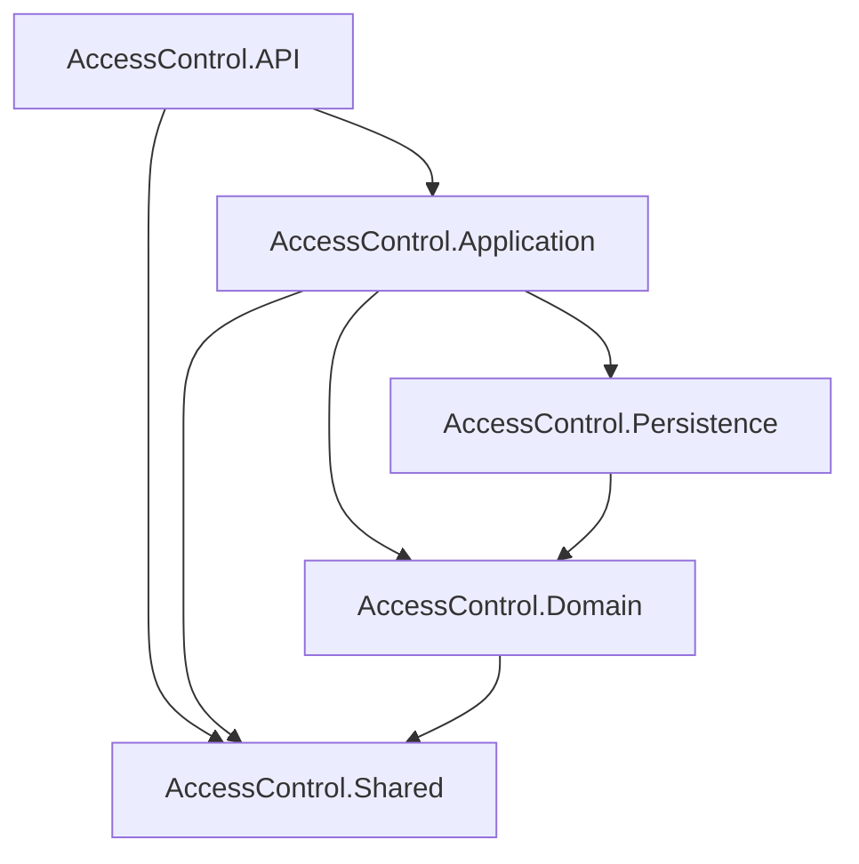

## 📁 Proyecto: `AccessControl`

```
AccessControl.sln
│
├── 📁 AccessControl.API             # Proyecto de presentación (Web API Controllers)
│   ├── Program.cs
│   ├── appsettings.json
│   └── Controllers
│       └── AuthController.cs
│       └── OwnersController.cs
│       └── VisitsController.cs
│       └── MenuController.cs
│       └── DashboardController.cs
│
├── 📁 AccessControl.Application     # Lógica de negocio e interfaces
│   ├── Interfaces
│   │   └── IAuthService.cs
│   │   └── IVisitService.cs
│   │   └── IMenuService.cs
│   │   └── IDashboardService.cs
│   └── Services
│       └── AuthService.cs
│       └── VisitService.cs
│       └── MenuService.cs
│       └── DashboardService.cs
│
├── 📁 AccessControl.Domain          # Entidades del dominio
│   └── Entities
│       └── User.cs
│       └── Residence.cs
│       └── Visit.cs
│       └── Menu.cs
│       └── RoleMenu.cs
│
├── 📁 AccessControl.Persistence     # Acceso a datos (EF Core, DbContext, repositorios)
│   ├── ApplicationDbContext.cs
│   ├── Generics
│   │   └── IRepository.cs
│   │   └── Repository.cs
│   └── Migrations
│       └── [Archivos de Migración de EF]
│
└── 📁 AccessControl.Shared          # DTOs, Enums, y código común
    ├── Dtos
    │   ├── Auth
    │   │   └── AuthDtos.cs
    │   └── Visit
    │       └── CreateVisitDto.cs
    │       └── UpdateVisitDto.cs
    │       └── VisitFilterDto.cs
    └── Enums
        └── Role.cs
```

---

###  Diagrama de Flujo de Capas



### Reglas de Codificación

*   **Nombres de proyectos:** `AccessControl.ProjectName`
*   **Nombres de archivos:** `ClassName.cs`
*   **Nombres de clases:** `PascalCase`
*   **Nombres de métodos:** `PascalCaseAsync` (para métodos asíncronos)
*   **Nombres de variables:** `camelCase`
*   **Interfaces:** `IPascalCase`
*   **DTOs:** `PascalCaseDto`
*   **Inyección de dependencias:** Usar el constructor para inyectar dependencias.
*   **Controladores:** Deben ser delgados y delegar la lógica de negocio a los servicios.
*   **Servicios:** Contienen la lógica de negocio y usan repositorios para acceder a los datos.
*   **Repositorios:** Abstraen el acceso a los datos y usan el `DbContext` de Entity Framework Core.
*   **Entidades:** Clases simples que representan las tablas de la base de datos.
*   **DTOs:** Clases simples para transferir datos entre capas.

### Patrón Repository

Este proyecto utiliza el patrón Repository para abstraer el acceso a los datos. La implementación genérica se encuentra en `AccessControl.Persistence/Generics` y consta de una interfaz `IRepository<T>` y una clase `Repository<T>`. Esto permite realizar operaciones CRUD (Crear, Leer, Actualizar, Eliminar) de forma estandarizada para cualquier entidad del dominio.

### Uso de DTOs en el Proyecto Común

Los Data Transfer Objects (DTOs) se utilizan para transferir datos entre las diferentes capas de la aplicación. Se encuentran en el proyecto `AccessControl.Shared`, lo que permite que sean utilizados tanto por el backend como por el frontend (si fuera necesario). Esto ayuda a mantener un bajo acoplamiento entre las capas y a definir contratos de datos claros.

### Buenas Prácticas de Validación y Seguridad

*   **Validación:** Usar `FluentValidation` para validar los DTOs de entrada en la capa de la API.
*   **Autorización:** Usar políticas de autorización para restringir el acceso a los endpoints.
*   **Autenticación:** Usar JWT para autenticar a los usuarios.
*   **Secretos:** Usar el `Secret Manager` de .NET para almacenar secretos en desarrollo.
*   **CORS:** Configurar CORS para permitir solicitudes solo desde el frontend.

### Cómo Agregar Nuevos Endpoints y Repositorios

**Agregar un nuevo repositorio:**

1.  Crear una nueva interfaz en `AccessControl.Application/Interfaces` que herede de `IRepository<T>`.
2.  Crear una nueva clase en `AccessControl.Persistence/Repositories` que implemente la nueva interfaz y herede de `Repository<T>`.
3.  Registrar el nuevo repositorio en `Program.cs`.

**Agregar un nuevo endpoint:**

1.  Crear un nuevo DTO en `AccessControl.Shared/Dtos` si es necesario.
2.  Crear un nuevo método en la interfaz del servicio en `AccessControl.Application/Interfaces`.
3.  Implementar el nuevo método en la clase del servicio en `AccessControl.Application/Services`.
4.  Crear un nuevo método en el controlador en `AccessControl.API/Controllers` que use el nuevo método del servicio.

---
### 🔐 Nota de Seguridad: Gestión de Secretos

**No almacene datos sensibles como contraseñas de bases de datos o claves JWT directamente en los archivos de configuración.** Este proyecto está configurado para usar el .NET Secret Manager en desarrollo.

Para configurar su entorno local, ejecute los siguientes comandos desde el directorio `backend/AccessControl.API`:

```bash
dotnet user-secrets init
dotnet user-secrets set "ConnectionStrings:DefaultConnection" "Host=ep-mute-cherry-a4j6mcyc-pooler.us-east-1.aws.neon.tech;Database=verceldb;Username=default;Password=<SU_CONTRASEÑA_REAL>;Ssl Mode=Require;Trust Server Certificate=true"
dotnet user-secrets set "Jwt:Key" "<SU_CLAVE_JWT_SUPER_SECRETA>"
```

Reemplace `<SU_CONTRASEÑA_REAL>` y `<SU_CLAVE_JWT_SUPER_SECRETA>` con sus credenciales reales.

### 👤 Creación de Usuarios

Los usuarios se pueden crear a través de la API. El endpoint `POST /api/auth/register` está protegido y requiere el JWT de un usuario `Admin` para la autorización.

**Endpoint:** `POST https://localhost:7262/api/auth/register`

**Encabezados:**
- `Content-Type: application/json`
- `Authorization: Bearer <TOKEN_JWT_DE_ADMIN>`

**Cuerpo de la Solicitud:**

```json
{
  "email": "usuario@example.com",
  "firstName": "John",
  "lastName": "Doe",
  "apartmentNumber": "101",
  "password": "UnaContraseñaSegura123!",
  "role": <ID_DE_ROL>
}
```

**IDs de Rol:**
- `0`: Admin
- `1`: Guardia
- `2`: Propietario

**Ejemplos con cURL:**

*   **Crear un usuario Admin:**
    ```bash
    curl -X POST https://localhost:7262/api/auth/register \
    -H "Content-Type: application/json" \
    -H "Authorization: Bearer <TOKEN_JWT_DE_ADMIN>" \
    -d '{
      "email": "admin@example.com",
      "firstName": "Admin",
      "lastName": "User",
      "apartmentNumber": "000",
      "password": "UnaContraseñaSegura123!",
      "role": 0
    }'
    ```

*   **Crear un usuario Guardia:**
    ```bash
    curl -X POST https://localhost:7262/api/auth/register \
    -H "Content-Type: application/json" \
    -H "Authorization: Bearer <TOKEN_JWT_DE_ADMIN>" \
    -d '{
      "email": "guardia@example.com",
      "firstName": "Guardia",
      "lastName": "User",
      "apartmentNumber": "000",
      "password": "UnaContraseñaSegura123!",
      "role": 1
    }'
    ```

*   **Crear un usuario Propietario:**
    ```bash
    curl -X POST https://localhost:7262/api/auth/register \
    -H "Content-Type: application/json" \
    -H "Authorization: Bearer <TOKEN_JWT_DE_ADMIN>" \
    -d '{
      "email": "propietario@example.com",
      "firstName": "John",
      "lastName": "Doe",
      "apartmentNumber": "101",
      "password": "UnaContraseñaSegura123!",
      "role": 2
    }'
    ```
